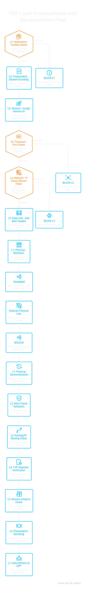
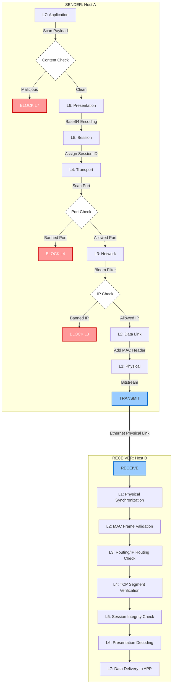

# Multi-Layer Packet Filtering System: Project Documentation

## 1. Project Overview
This project is a high-fidelity simulation of a modern network security firewall based on the **7-Layer OSI (Open Systems Interconnection) Model**. It demonstrates how data is processed, encapsulated, and filtered at every stage of network communication.

---

## 2. Objectives
- **Simulate Real-World OSI Layers**: Implement distinct logic for each of the 7 layers.
- **Advanced Algorithmic Filtering**: Use specialized data structures (Bloom Filter, Trie, Rabin-Karp) for high-performance security checks.
- **Protocol Simulation**: Demonstrate the concepts of **Encapsulation** (at the sender) and **Decapsulation** (at the receiver).
- **Security Logic**: Block packets based on content (L7), ports (L4), and IP addresses (L3).
- **Educational Visualization**: Provide a clear, step-by-step console output of the packet's journey.

---

## 3. System Architecture

### Modular Component Breakdown
The system is divided into four main packages:

1.  **`algorithms/`**: Contains the core mathematical and logical engines for filtering.
    - `bloom_filter.py`: Probabilistic data structure for IP blacklisting.
    - `trie.py`: Prefix tree for fast keyword matching.
    - `rabin_karp.py`: Rolling hash algorithm for pattern searching.
2.  **`layers/`**: Implements the OSI stack.
    - `base_layer.py`: Abstract base class for all layers.
    - `l1_physical.py` to `l7_application.py`: Layer-specific logic.
3.  **`models/`**: Defines the data structures.
    - `packet.py`: The core object representing data being transmitted.
4.  **`utils/`**: Helper functions.
    - `logger.py`: Provides color-coded, formatted terminal output.

---

## 4. Detailed Layer Breakdown

| Layer | Name | Functionality | Security/Filtering Logic |
| :--- | :--- | :--- | :--- |
| **L7** | **Application** | High-level data generation. | **Trie & Rabin-Karp**: Scans payload for "malware", "exploit", or "drop database". |
| **L6** | **Presentation** | Data formatting & encryption. | **Base64 Encoding**: Simulates encryption/formatting for transmission. |
| **L5** | **Session** | Connection management. | **Session Tracking**: Assigns unique IDs and manages connection states. |
| **L4** | **Transport** | End-to-end communication. | **Port Filtering**: Blocks banned ports (e.g., 4444, 23). |
| **L3** | **Network** | Routing and addressing. | **Bloom Filter**: Efficiently blocks banned IP addresses (e.g., 1.1.1.1). |
| **L2** | **Data Link** | Local framing. | **MAC Addressing**: Adds source and destination MAC headers. |
| **L1** | **Physical** | Bitstream conversion. | **Binary Simulation**: Converts the entire frame into a 0/1 bitstream. |

---

## 5. Algorithms Explained

### A. Bloom Filter (used in Layer 3)
A **Bloom Filter** is a space-efficient probabilistic data structure used to test whether an element is a member of a set.
- **Why?**: It allows checking billions of banned IPs in milliseconds using very little memory.
- **How?**: Uses multiple hash functions to set bits in an array. If all bits for an IP are 1, the IP is "possibly" banned. If any bit is 0, it is "definitely not" banned.

### B. Trie (used in Layer 7)
A **Trie** (or Prefix Tree) is used for rapid retrieval of strings.
- **Why?**: Traditional string searching is slow; Trie allows matching keywords in $O(M)$ time, where $M$ is the length of the string, regardless of the number of patterns.
- **How?**: Stores characters in a tree structure where each path from the root represents a word.

### C. Rabin-Karp (used in Layer 7)
The **Rabin-Karp** algorithm is a string-searching algorithm that uses hashing.
- **Why?**: It is ideal for finding multiple patterns simultaneously within a single payload.
- **How?**: It calculates a "rolling hash" of the pattern and compares it with the hash of substrings in the payload. If hashes match, it does a final character check.

---

## 6. Workflow & Flow Diagram

### Encapsulation Flow (Sender)
1. **L7**: Inspects content. Blocks if "malicious" keywords are found.
2. **L6**: Encodes/Encrypts the payload.
3. **L5**: Generates a Session ID.
4. **L4**: Checks Port numbers. Blocks if the port is unauthorized.
5. **L3**: Checks the Destination IP via Bloom Filter. Blocks if banned.
6. **L2**: Wraps into an Ethernet Frame with MAC addresses.
7. **L1**: Converts everything into Raw Bits (0s and 1s).

### Decapsulation Flow (Receiver)
1. **L1**: Synchronizes the bitstream.
2. **L2**: Validates MAC address destination.
3. **L3**: Validates IP source/target.
4. **L4**: Verifies TCP segment integrity.
5. **L5**: Verifies Session ID existence.
6. **L6**: Decodes/Decrypts data back to original format.
7. **L7**: Delivers the final payload to the target application.

### Visual Flowchart Diagram


### Logical Flow Representation (Mermaid)



---

## 7. Program Components Breakdown

### Main Driver (`main.py`)
Orchestrates the entire simulation. It takes a list of `Packet` objects and runs them through the `MultiLayerFilteringSystem` class, which manages the sender and receiver chains.

### Packet Model (`models/packet.py`)
A class that carries all the metadata required by different layers, including IPs, Ports, MAC addresses, and the shifting payload state.

### Visual Logger (`utils/logger.py`)
A utility using ANSI escape codes to print bold, color-coded status updates. It highlights "BLOCKED" events in red and "OK" events in green.

---

## 8. How to Run the Simulation
1. Ensure Python 3.x is installed.
2. Open a terminal in the project directory.
3. Run the following command:
   ```bash
   python main.py
   ```
4. Observe the four pre-configured test scenarios:
    - **Packet 1**: Fully Allowed (Standard HTTP/S).
    - **Packet 2**: Blocked at L7 (Security Exploit detected).
    - **Packet 3**: Blocked at L4 (Forbidden Port 4444).
    - **Packet 4**: Blocked at L3 (Blacklisted IP detected by Bloom Filter).

---

## 9. Conclusion
This project successfully demonstrates the complexity and modularity of modern network filtering. By combining classical protocol layering theory with efficient algorithmic implementations, it provides a comprehensive look at how digital safely travels across the globe.
